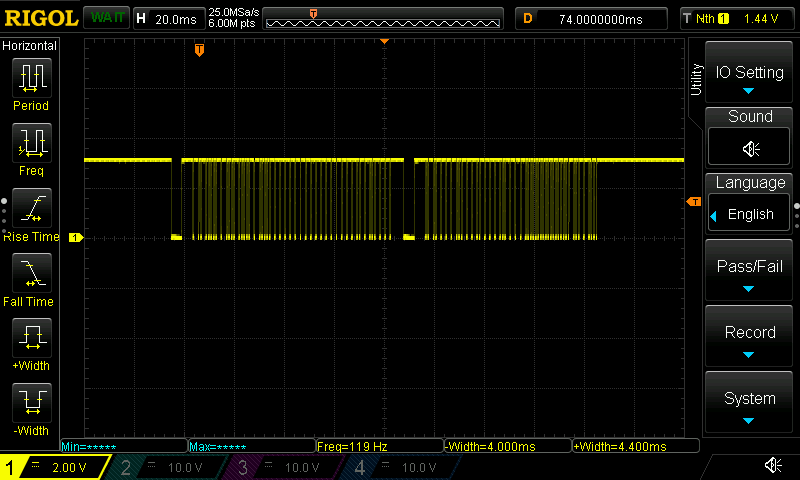
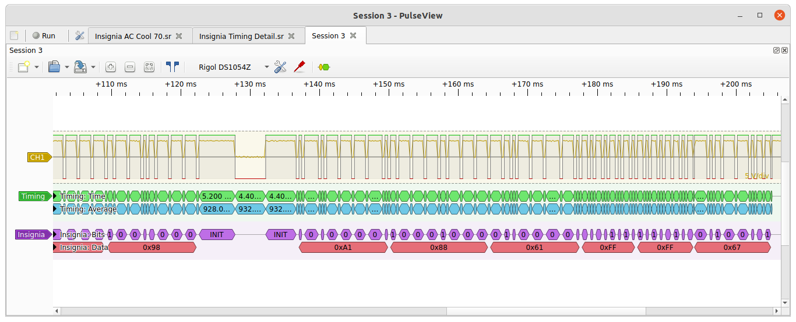
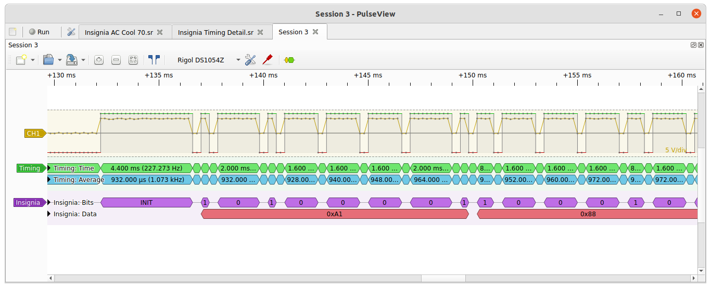
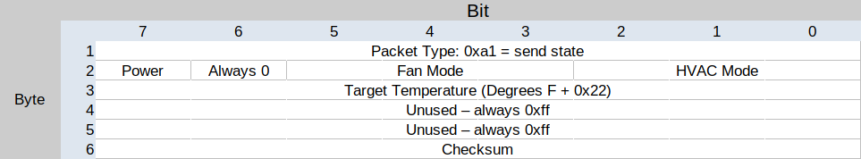
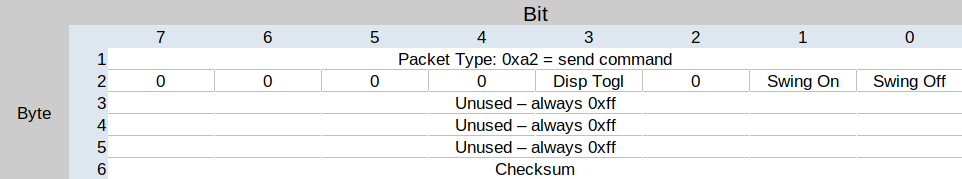
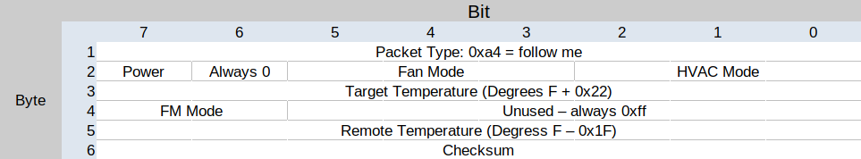

## Experiments in Air Conditoner IR code recording

### Device: Insignia NS-AC08PWH1

IR signal duty is 38khz modulated, 50% duty cycle

Sampling from a Sensibo IR gateway, since I don't have access to the factory remote.

## Timings 

* packets start with a 4400us pulse, followed by 4400us wait
* Subsequent pulses are always 400us long
* A High bit is encoded as a 600us wait between pulses
* A low bit is encoded as a 1600us wait between pulses
* Packets end with another 4400us pulse, and always have at least a 5000us wait betwen them
* Sensibo gateway sends a 4400us START/STOP pulse at the beginning and end of both packets
* Factory remote omits the 4400us pulse at the end of the second packet

Signals are 2 packets wide, but the 2nd packet seems to just be a 1's complement of the first. Both the Senisbo gateway and the factory remote behave this way.

I've been choosing to ignore the first packet, as the second encodes things more intuitively (e.g. '1' is 'on', and higher temperatures are encoded as larger hex values). I've yet to confirm if both codes are necessary to operate the device.

## Packet Structure

Packets are always exactly six octets long.

Packets can be one of two different formats, and only one will be sent at a time.

* State packets begin with 0xa1, and encode power state, fan mode, HVAC mode, and target temperature. These are fully idempotent and declarative, representing the intended state of the device, rather than the changes to make to it.
* Command packets begin with 0xa2, and encode specific changes that are not included in the state.

## State Packet

	Octet 1: Packet Type
		0xa1 = state (normal packet, sends modes and target temperature)
		0xa2 = command (sends a command that does NOT include modes and target)
	Octet 2: Power State + Fan mode + HVAC Mode
	MSB	7: Power
		6: Always 0
		5: Fan Mode
		4: Fan Mode
		3: Fan Mode
		2: HVAC Mode
		1: HVAC Mode
	LSB	0: HVAC Mode 
	Octet 3: Target temperature (Degress F + 34)
		62 Farenheit -> 0x60
		86 Farenheit -> 0x78
		The Senisbo API doesn't allow trying to send values outside of this - I'll have to see what happens when we try
	Octet 4, 5: Always 0xff
	Octet 6: Checksum 

### Byte 2 Encoding

|Power|Bit 7|
|---|---|
|On|1|
|Off|0|

|Fan Mode|Bit 5|Bit 4|Bit 3|
|---|---|---|---|
|Auto|1|0|0|
|High|0|1|1|
|Med |0|1|0|
|Low |0|0|1|

|HVAC Mode|Bit 2|Bit 1|Bit 0|
|---|---|---|---|
|Fan  |1|0|0|
|Heat |0|1|1|
|Auto |0|1|0|
|Dry  |0|0|1|
|Cool |0|0|0|

## Command Packet

Display control is sent as a toggle command packet
Oscillation control is sent as an idempotent on/off command packet 

	Octet 1: Packet Type
		0xa1 = state (normal packet, sends modes and target temperature)
		0xa2 = command (sends a command that does NOT include modes and target)
		0xa4 = follow me (updates thermostat, but NOT target state)
	Octet 2: Power State + Fan mode + HVAC Mode
	MSB	7: Always 0
		6: Always 0
		5: Always 0
		4: Always 0
		3: Toggle Display if set
		2: Always 0
		1: Enable Oscillation if set
	LSB	0: Disable Oscillation if set
	Octet 3-5: Always 0xff
	Octet 6: Checksum? 

## Follow Me Packet

The AC has a "Follow Me" mode, in which the factory remote acts as a thermostat, and the AC unit uses updates from the remote in leiu of its own sensor.
These packets should not cause the AC unit to beep or wake the display.
This packets have header of 0xA4, and use the fifth octet to transmit temperature information.
The forth packet seems to contain information about toggling Follow Me mode on an off
Octets 2 and 3 are identical to a state packet

The AC will disable Follow Me mode if it does not receive an update packet for 7 minutes.

	Octet 1: Packet Type
		0xa4 = follow me
	Octet 2: Power State + Fan mode + HVAC Mode
	MSB	7: Power
		6: Always 0
		5: Fan Mode
		4: Fan Mode
		3: Fan Mode
		2: HVAC Mode
		1: HVAC Mode
	LSB	0: HVAC Mode 
	Octet 3: Target temperature (Degress F + 34)
	Octet 4: Follow Me Options
	MSB 7: Follow Me Mode
		6: Follow Me Mode
		5: Always 1
		4: Always 1
		3: Always 1
		2: Always 1
		1: Always 1
	LSB 0: Always 1
	Octet 5: Follow Me reported temperature (Degrees F - 31)
	Octet 6: Checksum 

|FM Mode 	| Bit 7 | Bit 6 |
| --- 		| --- 	| --- 	|
| Enable	| 1 	| 1 	|
| Update 	| 0 	| 1 	|
| Disable 	| 0 	| 0 	|

Note - a full FM packet, including the current reported remote temperature, is included in the packet that sends the Disable command.

| Function | Data |
| --- | --- |
| (FM), Cool, Auto, T75 A75				| a4 a0 6d ff 2d b6 |
| FM, Cool, Auto, (T62) A78				| a4 a0 6d 7f 2c 77 |
| FM, Cool, Auto, T62 A76				| a4 a0 60 7f 2d 78 |
| FM, Cool, Auto, T62 A75				| a4 a0 60 7f 2c 79 |
| FM, Cool, Auto, T62 A74				| a4 a0 60 7f 2b 7f |
| (N), Cool, Auto, T62 A74				| a4 a0 60 3f 2b 00 |

## Sample Data

| Function | Data |
| --- | --- |
| (Off), Cool, Fan Auto, 63				| a1 20 61 ff ff cf |
| (Off), Cool, Fan Low, 63				| a1 08 61 ff ff e7 |
| (On),  Cool, Fan Auto, 63				| a1 a0 61 ff ff 4f |
| (On), Cool, Fan Low, 63				| a1 88 61 ff ff 67 |
| On, (Heat), Fan Auto, 63				| a1 a3 61 ff ff 4c |
| On, (Cool), Fan Auto, 63				| a1 a0 61 ff ff 4f |
| On, (Fan), Fan Auto, --				| a1 a4 7e ff ff 58 |
| On, (Dry), Fan Auto, 63				| a1 81 61 ff ff 6e |
| On, (Auto), Fan Auto, 63				| a1 82 61 ff ff 6d |
| On, Cool, Fan High, (63)				| a1 98 61 ff ff 7b |
| On, Cool, (Fan Auto), 63				| a1 a0 61 ff ff 4f |
| On, Cool, (Fan Strong), 63			| a1 98 61 ff ff 7b |
| On, Cool, (Fan High), 63				| a1 98 61 ff ff 7b |
| On, Cool, (Fan Med), 63				| a1 90 61 ff ff 77 |
| On, Cool, (Fan Low), 63				| a1 88 61 ff ff 67 |
| On, Cool, (Fan Quiet), 63				| a1 88 61 ff ff 67 |
| Light Toggle							| a2 08 ff ff ff 75 |
| Swing on 								| a2 02 ff ff ff 7e |
| Swing off								| a2 01 ff ff ff 7c |

## Checksum calculation

Last octet transmitted in each packet is the checksum. Samples:

|Function|Data|Checksum|
|---|---|---|
|On, Cool, Low, 83	|a1 88 75 ff ff |7d | 
|on, cool, low, 82	|a1 88 74 ff ff |7c | 
|on, cool, low, 81	|a1 88 73 ff ff |79 | 
|on, cool, low, 80 	|a1 88 72 ff ff |78 | 
|on, cool, low, 79	|a1 88 71 ff ff |7b | 
|on, cool, low, 78 	|a1 88 70 ff ff |7a | 
|on, cool, low, 77 	|a1 88 6f ff ff |6e | 
|off,cool, low, 77 	|a1 08 6f ff ff |ee | 

Checksum function seems to be:

* Reverse the order of the bits every octet (0x01 -> 0x80, etc.)
* Add a 0xff padding byte
* Sum all five bytes, including the unused ones (three 0xff's in total)
* AND 0xff (modulo 0x0100)
* Reverse the order of the bits again
* Negate (one's compliment)

Some messy and ineffecient Python:

	def rev(data):
	  return int(format(data, '0%db' % 8)[::-1], 2)
	def check1(p1, p2, p3):
	    return hex( (rev((0xff + rev(p1) + rev(p2) + rev(p3) + 0xff + 0xff) & 0xff) ^ 0xff ))
	check1(0xa1, 0x88, 0x75)

### Device: Wynter?

Timings and byte encodings appear to be the same, but packet structure is different

Packets being with a 8800us start pulse followed by a 4600us wait, and are 4 bytes long, but do not have a stop block.

Bytes are encoded LSB first which is the oppostite of the Insignia device

Supported fucntions

HVAC Modes:

* Cool
* Dry
* Fan

3 Fan Speeds

Timer function (enabling and adusting sends codes)

F/C adjust 

|Function|Data|
|---|---|
|cool,high,74	| ed e7 ea ad |
|cool,high,75	| ed e7 ea 2d |
|cool,high,76	| ed e7 ea cd |
|cool,high,77	| ed e7 ea 4d |
|cool,high,78 	| ed e7 ea 8d |
|cool,high,79	| ed e7 ea 0d |
|cool,high,80 	| ed e7 ea f5 |
|cool,high,89 	| ed e7 ea 65 |
|cool,med, 80 	| ed d7 ea f5 |
|cool,low, 80 	| ed b7 ea f5 |
|F->C 			| ed b7 ee 2f |
|C->F 			| ed b7 ea f5 |
|Timer on 8		| ed b7 e8 f5 |
|Timer down 7 	| ed b7 18 f5 |
|Timer down 6 	| ed b7 98 f5 |
|Timer down 5 	| ed b7 58 f5 |
|Timer off 		| ed b7 5a f5 |
|dry ,low, -- 	| ed bd fa f5 |
|fan,low, -- 	| ed be ea f5 |
|fan,high, -- 	| ed ee 5a f5 |
|off,cool,high,80|ed e7 b3 f5 |
|off,fan,low,80 | ed be b3 f5 |
|off,cool,low,80| ed b7 b3 f5 |
|cool,high,80 	| ed e7 ea f5 |
|dry, high,80 	| ed ed ea f5 |
|fan, high,80 	| ed ee ea f5 |
|on,cool,high,80| ed e7 ea f5 |
|off,cool,high,80|ed e7 b3 f5 |

## Packet Structure

* Octet 1: Device code - always 0xed
* Octet 2: HVAC Mode, Fan Speed
LSB	0: Always 1
	1: Fan Speed
	2: Fan Speed
	3: Fan Speed
	4: HVAC Mode
	5: HVAC Mode
	6: HVAC Mode
MSB	7: HVAC Mode
* Octet 3: Timer, F/C, Power
LSB	0: Timer
	1: Timer
	2: Timer
	3: Timer
	4: Power
	5: F/C
	6: ?
MSB	7: ?
* Octet 4: Target temperature
Farenheit temperature directly recorded in ones compliment, LSB first, 
so 74 degrees farenheit = 0xAD.
Celcius temperature is the same, but with 16 degress (0x10) subtracted, so 29 degress celcius = 0xF2

|Function|Data|
|---|---|
|on,cool,high,c,29	| ed ed ee 4f |
|on,cool,high,c,30	| ed e7 ee 8f |
|on,cool,high,c,31	| ed e7 ee 0f |
|on,cool,high,c,32	| ed e7 ee f7 |
